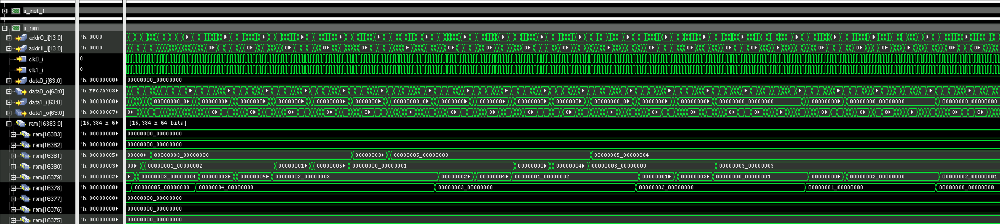

<div align="center"> <h1> Computer Organization and Architecture III  </h1>
</div>

This project is part of the Computer Organization and Architecture III (2024.2) course. The objective of the project was to implement a logical synthesis of [biRISC-V Core](http://github.com/ultraembedded/biriscv) using IBM 180 PDK and perform a Gate Level Simulation.


1. [biRISC-V](#biriscv)
2. [Logic Synthesis](#logic-synthesis)
3. [Generating Applications](#generating-applications)
4. [Gate Level Simulation](#gate-level-simulation)

<hr />

## biRISC-V <a name="biriscv"></a>

biRISC-V is a 32-bit dual issue RISC-V CPU made by [Ultraembedded](http://github.com/ultraembedded).


### Features
* 32-bit RISC-V ISA CPU core.
* Superscalar (dual-issue) in-order 6 or 7 stage pipeline.
* Support RISC-V’s integer (I), multiplication and division (M), and CSR instructions (Z) extensions (RV32IMZicsr).
* Branch prediction (bimodel/gshare) with configurable depth branch target buffer (BTB) and return address stack (RAS).
* 64-bit instruction fetch, 32-bit data access.
* 2 x integer ALU (arithmetic, shifters and branch units).
* 1 x load store unit, 1 x out-of-pipeline divider.
* Issue and complete up to 2 independent instructions per cycle.
* Supports user, supervisor and machine mode privilege levels.
* Basic MMU support - capable of booting Linux with atomics (RV-A) SW emulation.
* Implements base ISA spec [v2.1](docs/riscv_isa_spec.pdf) and privileged ISA spec [v1.11](docs/riscv_privileged_spec.pdf).
* Verified using [Google's RISCV-DV](https://github.com/google/riscv-dv) random instruction sequences using cosimulation against [C++ ISA model](https://github.com/ultraembedded/exactstep).
* Support for instruction / data cache, AXI bus interfaces or tightly coupled memories.
* Configurable number of pipeline stages, result forwarding options, and branch prediction resources.
* Synthesizable Verilog 2001, Verilator and FPGA friendly.
* Coremark:  **4.1 CoreMark/MHz**
* Dhrystone: **1.9 DMIPS/MHz** ('legal compile options' / 337 instructions per iteration)

*A sequence showing execution of 2 instructions per cycle;*


## Logic Synthesis <a name="logic-synthesis"></a>

The synsthesis was performed with <i> Cadence RTL Compiler</i> , the execution scripts and the PDK (IBM 180) were provided by professor Mateus Beck.

The core modules that must be included in the synthesis filelist are:

```
project
│   
│
└───src
    │ biriscv_defs.v
    │ biriscv_alu.v
    │ biriscv_csr_regfile.v
    │ biriscv_csr.v
    │ biriscv_decoder.v
    │ biriscv_decode.v
    │ biriscv_divider.v
    │ biriscv_exec.v
    │ biriscv_fetch.v
    │ biriscv_frontend.v
    │ biriscv_issue.v
    │ biriscv_lsu.v
    │ biriscv_mmu.v
    │ biriscv_multiplier.v
    │ biriscv_npc.v
    │ biriscv_pipe_ctrl.v
    │ biriscv_regfile.v
    │ biriscv_trace_sim.v
    │ biriscv_xilinx_2r1w.v
    │ riscv_core.v
```

The non-synthesizable testbench modules are:

```
project
│
│
└───tb
   └───tb_core_icarus
        │   tcm_mem_ram.v
        │   tcm_mem.v
        │   biriscv_trace_sim_gls.sv
        │   tb_top.v
    
```

## Generating Applications <a name="generating-applications"></a>

On `riscv-app-gen` you can find some risc-v applications (C, bin, elf) in the subdirectories. Also, you can generate your own program file by executing the `make` command specifying the C code e.g `make SRC=main.c`. 

You must have [riscv-gnu-toolchain](https://github.com/riscv-collab/riscv-gnu-toolchain) installed with Linux multilib and available in your `PATH` environment variable.

The linker script `riscv-app-gen/link.ld` was obtained from [Google's RISCV-DV](https://github.com/google/riscv-dv).

The entry point specified in the linker command is the main function, therefore, you must check the entry point address code with the comand `make info` e.g `make info ELF=main.elf`. This entry point is required to execute the testbench and need to be passed to the `reset_vector_i` input in `src/riscv_core.v` .


## Gate Level Simulation <a name="gate-level-simulation"></a>

Post-synthesis Simulation using Cadence SimVision. Bubble sort execution.

